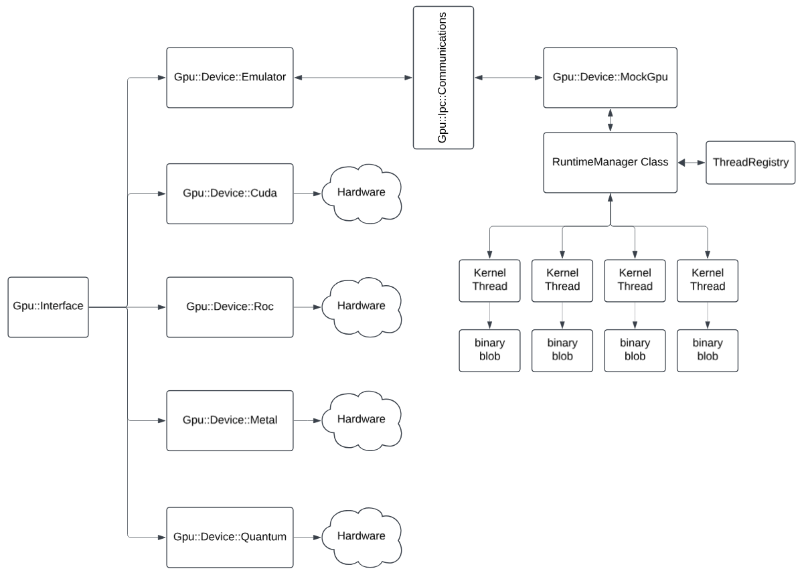

GPU Abstraction Layer Functionality
===================================

This document describes the abstract functionality provided by the Gpu::Device::Interface and its default Emulator
implementation. It serves as a reference for developers integrating GPU capabilities into the CRSCE project.



## Overview

The GPU abstraction layer isolates platform- and vendor-specific GPU APIs behind a minimal, consistent interface.
This allows:

| Feature                 | Description                                                                                   |
|-------------------------|-----------------------------------------------------------------------------------------------|
| Pluggable backends      | Swap between real GPU drivers and a mock emulator via compile-time flags.                     |
| Simplified testing      | Use the emulator to verify logic without requiring actual GPU hardware.                       |
| Incremental development | Begin with basic memory and data-transfer operations, extending to kernel dispatch as needed. |

## Related Documents

* [Gpu::Device::Emulator](./Gpu-Emulator.md)
* [Gpu::Ipc::CommandType](./Gpu-Ipc-CommandType.md)
*

## Interface Methods

All methods belong to the `Gpu::Device::Interface` abstract base class:

### Constructor

* Initialize the target GPU.

### Destructor

* Safely shutdown and clean up GPU.

### Lifecycle

| Scope  | Method                   | Description                                  |
|--------|--------------------------|----------------------------------------------|
| public | virtual bool init();     | re-initialize mock GPU state                 |
| public | virtual void shutdown(); | reset the mock GPU state                     |
| public | virtual void reset();    | shutdown the mock GPU and all of its threads |

### Memory Management


| Scope    | Method                                                      | Description                                              |
|----------|-------------------------------------------------------------|----------------------------------------------------------|
| `public` | `AbstractPtr* alloc(std::size_t bytes);`                    | Allocate device memory in the MemoryTracker table        |
| `public` | `bool free(Std::Gpu::AbstractPtr& ptr);`                    | Frees device memory previously allocated using `alloc()` |
| `public` | `bool write(Std::Gpu::AbstractPtr& dst, Buffer8& source);`  | write `source` buffer to the `destination`               |
| `public` | `bool write(Std::Gpu::AbstractPtr& dst, Buffer64& source);` | write `source` buffer to the `destination`               |
| `public` | `bool read(Std::Gpu::AbstractPtr& dst, Buffer8& source);`   | read the `source` from teh `destination` reference       |
| `public` | `bool read(Std::Gpu::AbstractPtr& dst, Buffer64& source);`  | read the `source` from teh `destination` reference       |


### Kernel Control
(`Gpu::KernelId` is a `uint64_t`)

| Scope    | Method                                                             | Description                              |
|----------|--------------------------------------------------------------------|------------------------------------------|
| `public` | `void registerKernel(KernelId id, const Common::Buffer8& binary);` | register a binary blob with a given GPU  |
| `public` | `bool launchTask(KernelId id, const Common::Buffer8& args = {});`  | launch a task using a pre-registered GPU |


### Matrix Math & Vector Operations

ToDo: fix all this...

| Scope    | Method                                                                       | Description           |
|----------|------------------------------------------------------------------------------|-----------------------|
| `public` | `void dot(Common::Buffer64& result, const Matrix& lhs, const Matrix& rhs);`  | calculate dot product |
| `public` | `void addv(Common::Buffer64& result, const Matrix& lhs, const Matrix& rhs);` | result = lhs+rhs      |
| `public` | `void subv(Common::Buffer64& result, const Matrix& lhs, const Matrix& rhs);` | result = lhs-rhs      |
| `public` | `void mulm(Common::Buffer64& result, const Matrix& lhs, const Matrix& rhs);` | result = lhs*rhs      |
| `public` | `void transpose(Common::Buffer64& result, const Matrix& mat);`               | transpose mat         |
| `public` | `void reduce(Common::Buffer64& result, const Matrix& mat, bool rowwise);`    | reduce mat            |

### Synchronization

| Scope    | Method                     | Description                                                                                                               |
|----------|----------------------------|---------------------------------------------------------------------------------------------------------------------------|
| `public` | `virtual void barrier();`  | Ensures running GPU threads reach the same execution point before any can proceed.                                        |
| `public` | `virtual void memfence();` | Provide memory-ordering guarantees by flushing pending memory writes to global/shared memory before continuing execution. |
| `public` | `virtual void yield();`    | This method hints to the runtime that the current kernel or task may yield control.                                       |

### Factory Method

- Selects the concrete implementation based on the GPU_EMULATOR compile-time flag.
- Default: Returns an instance of Gpu::Emulator.

```c++
static std::unique_ptr<Interface> Interface::create();
```
