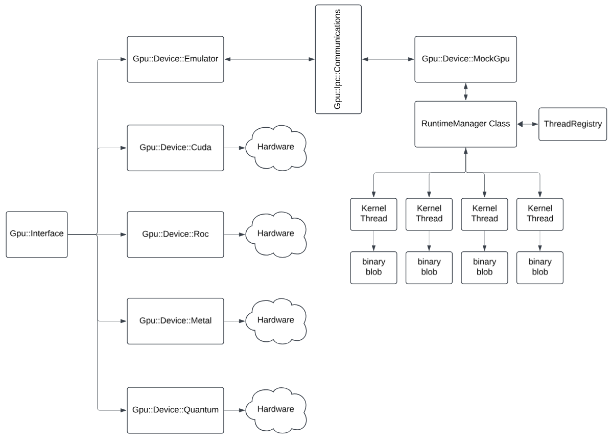

GPU Abstraction Layer Functionality
===================================

This document describes the abstract functionality provided by the Gpu::Device::Interface and its default Emulator
implementation. It serves as a reference for developers integrating GPU capabilities into the CRSCE project.

## Overview

The GPU abstraction layer isolates platform- and vendor-specific GPU APIs behind a minimal, consistent interface.
This allows:

| Feature                 | Description                                                                                   |
|-------------------------|-----------------------------------------------------------------------------------------------|
| Pluggable backends      | Swap between real GPU drivers and a mock emulator via compile-time flags.                     |
| Simplified testing      | Use the emulator to verify logic without requiring actual GPU hardware.                       |
| Incremental development | Begin with basic memory and data-transfer operations, extending to kernel dispatch as needed. |

## Related Documents

* [`Gpu::Device::Interface`](Gpu-Interface.md)
* [`Gpu::Device::Emulator`](Gpu-Emulator.md)
* [`Gpu::Device::Cuda`](Gpu-Cuda.md)
* [`Gpu::Device::Roc`](Gpu-AmdRoc.md)
* [`Gpu::Device::Metal`](Gpu-AppleMetal.md)

## Architectural Summary

This documentation defines the GPU abstraction architecture used in the CRSCE project. It specifies a pure virtual
interface (`Gpu::Device::Interface`) which is implemented by multiple backends:

- `Gpu::Device::Emulator` — a fork-based, pipe-driven mock GPU using IPC and concurrent threads
- `Gpu::Device::Cuda`, `Gpu::Device::Roc`, `Gpu::Device::Metal` — future backends for CUDA, AMD ROCm, and Apple Metal

The emulator architecture includes:

- Parent process: command issuer (`Gpu::Device::Emulator`)
- Child process: command executor (`Gpu::Device::MockGpu`)
- IPC protocol: fixed-size binary messages (`Message`, `Response`)
- Runtime: kernel thread lifecycle via `RuntimeManager`, `ThreadRegistry`, `KernelManager`
- Safety: enforced state transitions (`init`, `reset`, `shutdown`) and serialization correctness

## Documentation Index

### Core Abstractions

- [`Gpu::Device::Interface`](Gpu-Interface.md)
- [`Gpu::Device::Emulator`](Gpu-Emulator.md)

### Supported GPU Stubs

- [`Gpu::Device::Cuda`](Gpu-Cuda.md)
- [`Gpu::Device::Roc`](Gpu-AmdRoc.md)
- [`Gpu::Device::Metal`](Gpu-AppleMetal.md)

### IPC and Communication

- [`Gpu::Ipc::Communications`](Gpu-Ipc-Communications.md)
- [`Gpu::Ipc::Message`](Gpu-Ipc-Message.md)
- [`Gpu::Ipc::Response`](Gpu-Ipc-Response.md)
- [`Gpu::Ipc::CommandType`](Gpu-Ipc-CommandType.md)
- [`Gpu::Ipc::Result`](Gpu-Ipc-Result.md)
- [`Gpu::Ipc::FailureCodes`](Gpu-Ipc-FailureCodes.md)
- [`Gpu::Ipc::MemoryTracker`](Gpu-Ipc-MemoryTracker.md)

### Buffers and Math

- [`Common::AbstractPtr`](Common-AbstractPtr.md)
- [`Common::Buffer8`](Common-Buffer8.md)
- [`Common::Buffer64`](Common-Buffer64.md)
- [`Gpu::Math::Matrix`](Gpu-Math-Matrix.md)

### Lifecycle and Exceptions

- [`reset`](../Abstract/reset.md)
- [`wait`](../Abstract/wait.md)
- [`Gpu::Exceptions`](Gpu-Exceptions.md)

### Safety and Principles

- [`Safety Principles`](../Abstract/safety_principles.md)

### Execution Runtime

- [`Gpu::RuntimeManager`](Gpu-RuntimeManager.md)
- [`Gpu::ThreadRegistry`](Gpu-ThreadRegistry.md)
- [`Gpu::ThreadRuntime`](Gpu-ThreadRuntime.md)
- [`Gpu::KernelManager`](Gpu-KernelManager.md)
- [`Gpu::Device::MockGpu`](Gpu-Device-MockGpu.md)
- [`Kernel Blob Format`](Kernel-Binary-Blob-Format.md)
